<p align="center">
  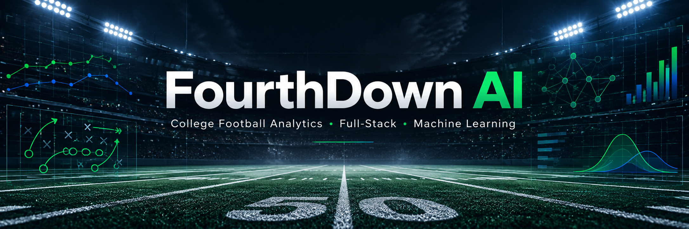
</p>

<h1 align="center">FourthDown AI</h1>

<p align="center">
  <strong>Full-stack college football analytics, weekly rankings, and machine-learning predictions.</strong>
</p>

<p align="center">
  <a href="https://frontend-production-9764a.up.railway.app"><strong>Live App</strong></a>
  ·
  <a href="https://backend-production-0139.up.railway.app/actuator/health">Backend Health</a>
  ·
  <a href="https://github.com/XavierM20/fourthdown-ai">GitHub</a>
</p>

<p align="center">
  
  
  
  
  
  
</p>

---

## Overview

**FourthDown AI** is an end-to-end college football analytics platform for exploring FBS and FCS teams, historical games, weekly rankings, team performance, and machine-learning matchup predictions.

The application combines a React + TypeScript frontend, a Spring Boot backend, PostgreSQL, and a private FastAPI inference service. College football data is imported from CollegeFootballData (CFBD), transformed into pregame features, and used by trained models to estimate both **win probability** and **projected final score**.

This project was built as a portfolio application to demonstrate practical full-stack engineering, production deployment, external API integration, relational data modeling, ML feature engineering, model evaluation, and service-to-service communication.

---

## Live Product

<p align="center">
  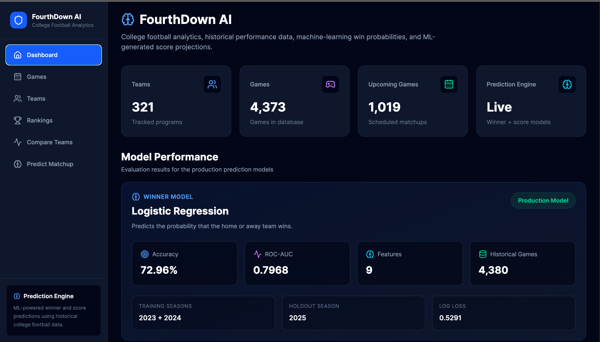
</p>

The production dashboard currently tracks **321 teams** and more than **4,300 games**, while exposing production model metrics directly in the UI.

### Core capabilities

| Area | What it does |
|---|---|
| **Dashboard** | Displays application totals, upcoming games, and model performance |
| **Teams** | Browse and filter FBS/FCS teams, metadata, records, analytics, and ranking history |
| **Games** | Explore regular-season, bowl, and playoff games by season and week |
| **Rankings** | Browse weekly AP, CFP, and FCS Coaches Poll rankings across seasons |
| **Compare Teams** | Compare team performance metrics side by side |
| **Predict Matchup** | Generate win probabilities, projected scores, and explanatory matchup factors |
| **ML Monitoring** | Surface holdout metrics and production model metadata inside the application |

---

## Screenshots

### Weekly FBS / FCS Rankings

<p align="center">
  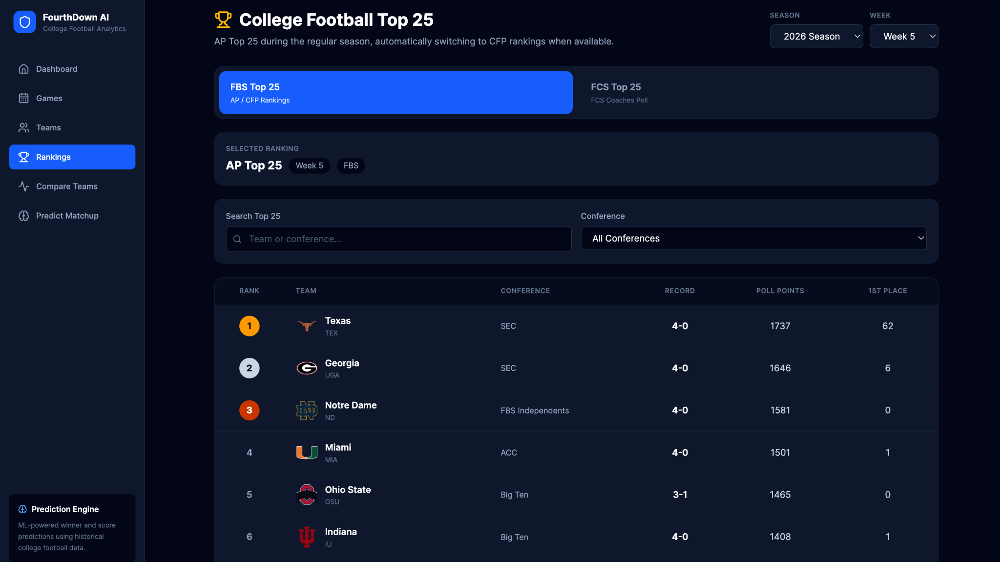
</p>

Rankings can be viewed by **season, classification, and week**. FBS automatically uses AP rankings before the CFP committee rankings become available, while FCS uses the FCS Coaches Poll.

### Team Details + Ranking History

<p align="center">
  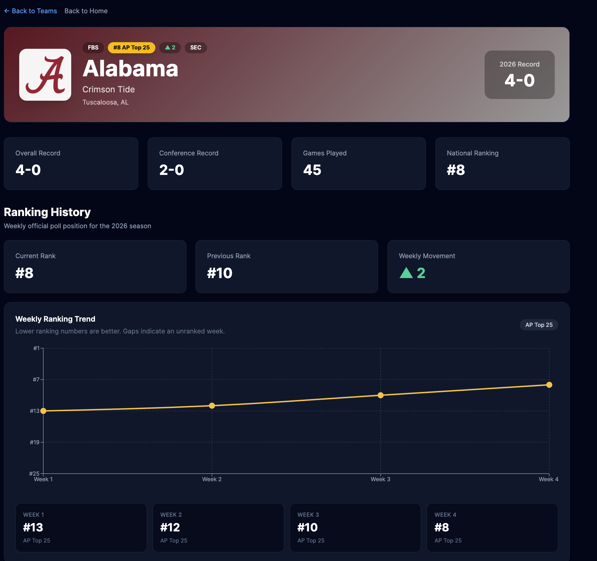
</p>

<p align="center">
  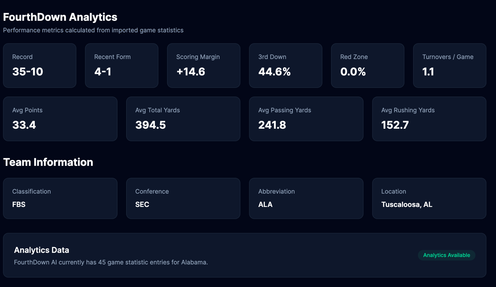
</p>

Team pages combine season records, conference information, current ranking, weekly movement, ranking history, and imported game-stat analytics.

### Game Explorer

<p align="center">
  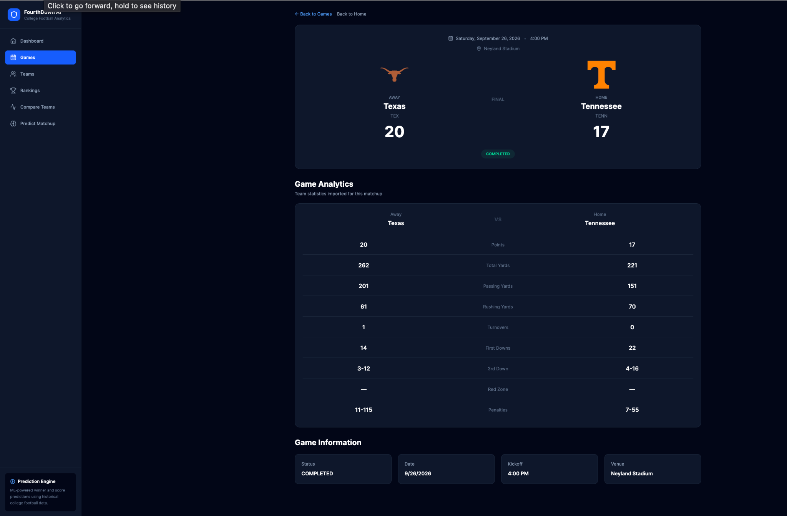
</p>

<p align="center">
  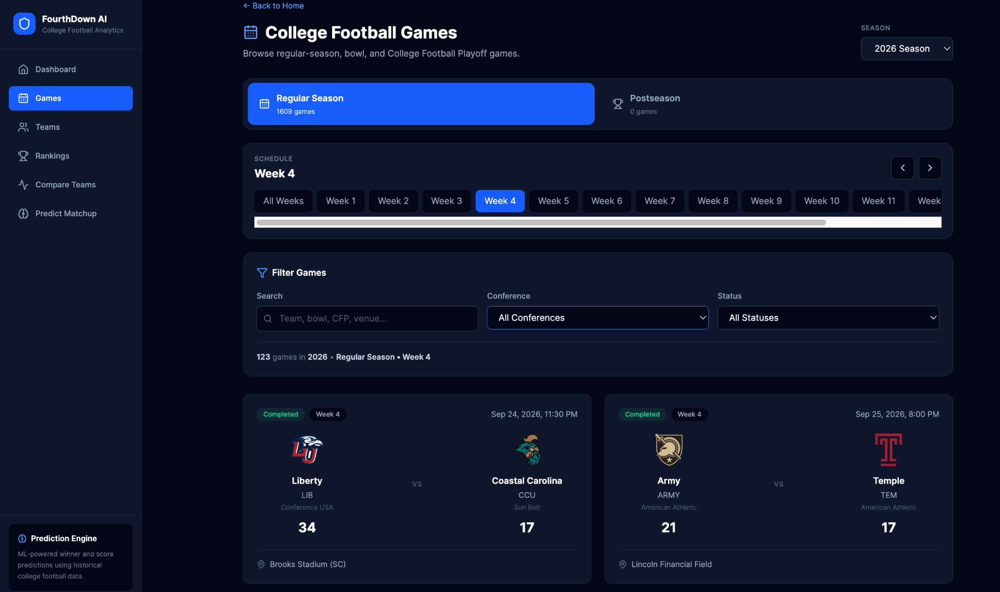
</p>

The game browser supports regular-season and postseason views, week navigation, conference filtering, status filtering, bowl names, playoff rounds, venues, and final scores.

### Matchup Prediction

<p align="center">
  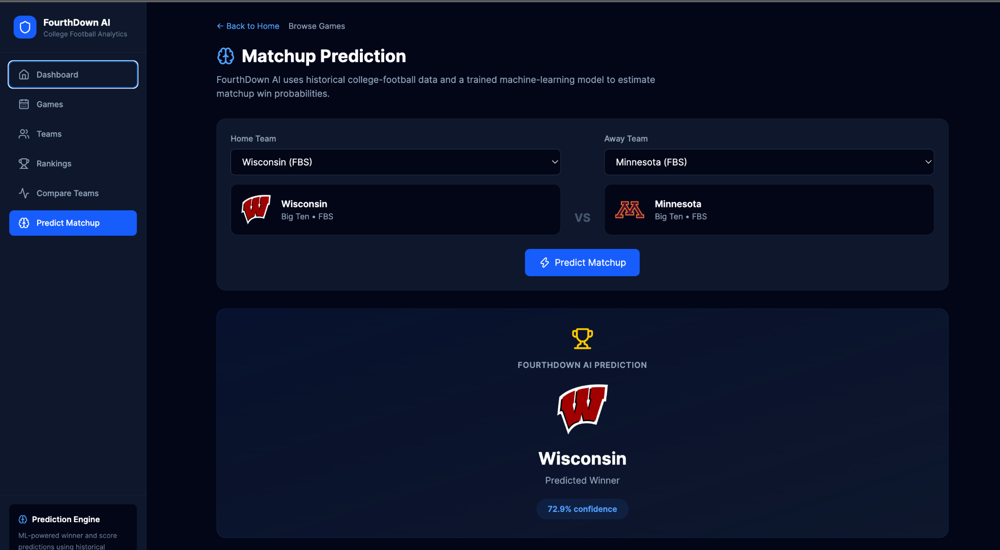
</p>

<p align="center">
  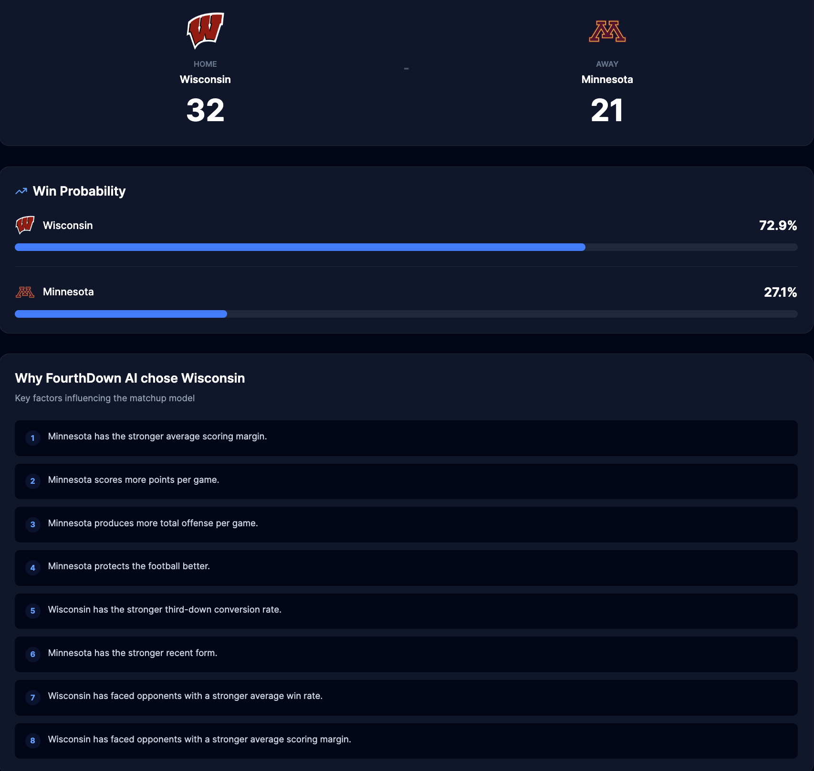
</p>

The prediction workflow combines a classification model for win probability with a regression model for projected scores. The UI also presents matchup factors used to explain the prediction.

### Team Browser

<p align="center">
  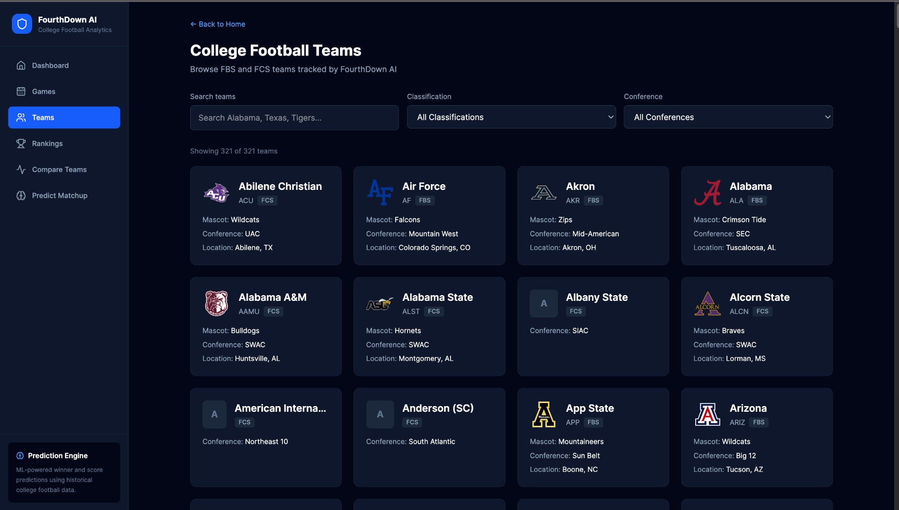
</p>

---

## Architecture

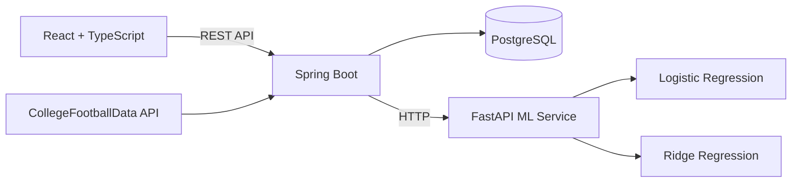

For standard application requests:

```text
Browser → React → Spring Boot → PostgreSQL
```

For predictions:

```text
Browser → React → Spring Boot
                       ├── PostgreSQL historical/team data
                       └── FastAPI → trained ML models
```

The browser never calls the Python service directly. Spring Boot acts as the public backend API and coordinates persistence, external data access, feature generation, and ML inference.

---

## Project Structure

```text
fourthdown-ai/
├── frontend/                  React + TypeScript + Vite
│   ├── src/api/               API clients
│   ├── src/components/        Reusable UI components
│   └── src/pages/             Dashboard, Teams, Games, Rankings, Compare, Predictions
│
├── backend/                   Spring Boot / Java 21
│   └── src/main/java/
│       ├── client/            CFBD + ML clients
│       ├── config/            CORS / application configuration
│       ├── controller/        REST controllers
│       ├── dto/               Request / response models
│       ├── model/             JPA entities
│       ├── repository/        Spring Data repositories
│       └── service/           Business logic + feature engineering
│
├── ml/                        FastAPI + scikit-learn
│   ├── models/                Model artifacts + metadata
│   ├── inference_api.py       ML inference service
│   ├── train_model.py         Winner-model training
│   └── train_score_model.py   Score-model training
│
├── docs/
│   ├── assets/
│   └── screenshots/
│
├── docker-compose.yml         PostgreSQL local environment
├── start-dev.sh               Local startup helper
└── README.md
```

---

## Tech Stack

### Frontend
- React
- TypeScript
- Vite
- Tailwind CSS
- React Router
- TanStack Query
- Recharts
- Lucide React

### Backend
- Java 21
- Spring Boot 4
- Spring Web MVC
- Spring Data JPA
- Spring Boot Actuator
- Maven

### Machine Learning
- Python
- FastAPI
- Uvicorn
- pandas
- NumPy
- scikit-learn
- joblib

### Infrastructure / Data
- PostgreSQL 16
- Docker + Docker Compose
- Railway
- CollegeFootballData (CFBD)

---

## Machine Learning

FourthDown AI uses two production models.

### Winner model — Logistic Regression

| Metric | Holdout Result |
|---|---:|
| Accuracy | **72.96%** |
| ROC-AUC | **0.7968** |
| Log Loss | **0.5291** |

### Score model — Ridge Regression

| Metric | Holdout Result |
|---|---:|
| Combined Team Score MAE | **9.73** |
| Margin MAE | **13.87** |
| Margin RMSE | **17.76** |
| Total Points MAE | **13.21** |
| Home Score MAE | **10.22** |
| Away Score MAE | **9.24** |

### Evaluation strategy

```text
Evaluation training seasons: 2023 + 2024
Holdout season:             2025
Training examples:          2,749
Testing examples:           1,631
Total examples:             4,380
Production features:        9
```

After evaluation, the production models are refit using the complete 2023–2025 dataset.

### Engineered features

1. Points
2. Total yards
3. Turnovers
4. Scoring margin
5. Third-down efficiency
6. Red-zone efficiency
7. Recent form
8. Opponent win rate
9. Opponent scoring margin

Historical training examples only use information available **before kickoff** of the game being predicted. Future-game data is excluded from feature calculation.

### Early-season fallback

| Current-season games | Current season | Prior season |
|---:|---:|---:|
| 0 | 0% | 100% |
| 1 | 25% | 75% |
| 2 | 50% | 50% |
| 3 | 75% | 25% |
| 4+ | 100% | 0% |

---

## Rankings

FourthDown AI supports **week-by-week historical rankings** for both FBS and FCS.

### FBS
- AP Top 25 during the early and regular season
- College Football Playoff committee rankings once available
- Season and weekly navigation
- Poll points and first-place votes
- Week-specific team records

### FCS
- FCS Coaches Poll
- Season and weekly navigation
- Poll points and first-place votes
- Week-specific team records

Team detail pages also visualize weekly ranking history, movement, and ranked/unranked transitions.

---

## Data Pipeline

The backend imports real college football data from CFBD, including:

- FBS and FCS teams
- schedules and final scores
- regular-season and postseason games
- bowls and College Football Playoff games
- FCS postseason games
- team game statistics
- weekly rankings

Team classification is derived from team metadata rather than assuming that every opponent in an FBS schedule is itself an FBS program.

A small number of completed games may not have detailed team-game statistics available from the upstream statistics endpoint. FourthDown AI preserves the valid game result instead of fabricating missing metrics.

---

## Representative API Endpoints

```text
GET  /api/v1/teams
GET  /api/v1/teams/{id}

GET  /api/v1/games
GET  /api/v1/games/{id}

GET  /api/v1/analytics/teams/{teamId}
GET  /api/v1/analytics/compare

GET  /api/v1/rankings
GET  /api/v1/rankings/weeks
GET  /api/v1/rankings/history

POST /api/v1/predictions/matchup
GET  /api/v1/predictions/game/{gameId}

GET  /api/v1/ml/model
GET  /api/v1/ml/score-model
```

Example:

```text
GET /api/v1/rankings?season=2024&classification=fbs&week=7
```

---

## Production Deployment

FourthDown AI is deployed on **Railway** as separate services:

```text
Public React Frontend
        │
        ▼
Public Spring Boot API
        │
        ├──────────────► Managed PostgreSQL
        │
        └──────────────► Private FastAPI ML Service
```

Production uses managed PostgreSQL, environment-based credentials, GitHub-connected deployments, production CORS, and private service-to-service ML communication.

### Production URLs

- **Frontend:** https://frontend-production-9764a.up.railway.app
- **Backend health:** https://backend-production-0139.up.railway.app/actuator/health

---

## Local Development

### Prerequisites

- Git
- Docker Desktop
- Java 21+
- Maven
- Node.js / npm
- Python 3

### Clone

```bash
git clone https://github.com/XavierM20/fourthdown-ai.git
cd fourthdown-ai
```

### Local environment

```bash
cp .env.example .env.local
```

Set your values, including:

```env
CFBD_API_KEY=replace_with_your_cfbd_api_key
SPRING_DATASOURCE_URL=jdbc:postgresql://localhost:5432/fourthdown
SPRING_DATASOURCE_USERNAME=fourthdown
SPRING_DATASOURCE_PASSWORD=fourthdown_dev
ML_BASE_URL=http://localhost:8000
FRONTEND_ORIGIN=http://localhost:5173
```

> Never commit `.env.local` or your CFBD API key.

Create `frontend/.env.development`:

```env
VITE_API_URL=http://localhost:8080/api/v1
```

Install dependencies:

```bash
cd frontend
npm install
cd ../ml
python3 -m venv .venv
source .venv/bin/activate
pip install -r requirements.txt
cd ..
```

Start the stack:

```bash
chmod +x start-dev.sh
./start-dev.sh
```

| Service | Local address |
|---|---|
| Frontend | `http://localhost:5173` |
| Spring Boot | `http://localhost:8080` |
| FastAPI | `http://localhost:8000` |
| PostgreSQL | `localhost:5432` |

---

## Health Checks

```bash
curl http://localhost:8080/actuator/health
curl http://localhost:8000/health
```

---

## Security / Configuration

- CFBD credentials remain backend-only.
- `.env.local` is excluded from Git.
- `VITE_*` values are public browser-build variables and must not contain secrets.
- PostgreSQL credentials are injected through environment variables.
- Production CORS is controlled through `FRONTEND_ORIGIN`.
- Spring Boot communicates with FastAPI server-to-server.

---

## Completed Milestones

- [x] FBS and FCS team import
- [x] Historical game import
- [x] Detailed team-game statistics
- [x] Bowl and playoff support
- [x] Team analytics
- [x] Team comparison
- [x] AP / CFP / FCS rankings
- [x] Weekly rankings by season
- [x] Weekly ranking history
- [x] Week-specific records in historical rankings
- [x] Winner prediction model
- [x] Score prediction model
- [x] FastAPI inference service
- [x] Environment-based configuration
- [x] One-command local startup
- [x] Railway production deployment
- [x] Managed production database
- [x] Public application URL
- [x] Real application screenshots

### Future improvements

- [ ] Automated CI validation for frontend/backend builds
- [ ] Additional model experimentation and calibration
- [ ] Expanded historical seasons
- [ ] Richer matchup explanation visualizations

---

## Author

**Xavier Mathews**

Computer Science / Software Engineering

FourthDown AI was built as a portfolio project focused on full-stack engineering, backend systems, sports-data pipelines, production deployment, and applied machine learning.
